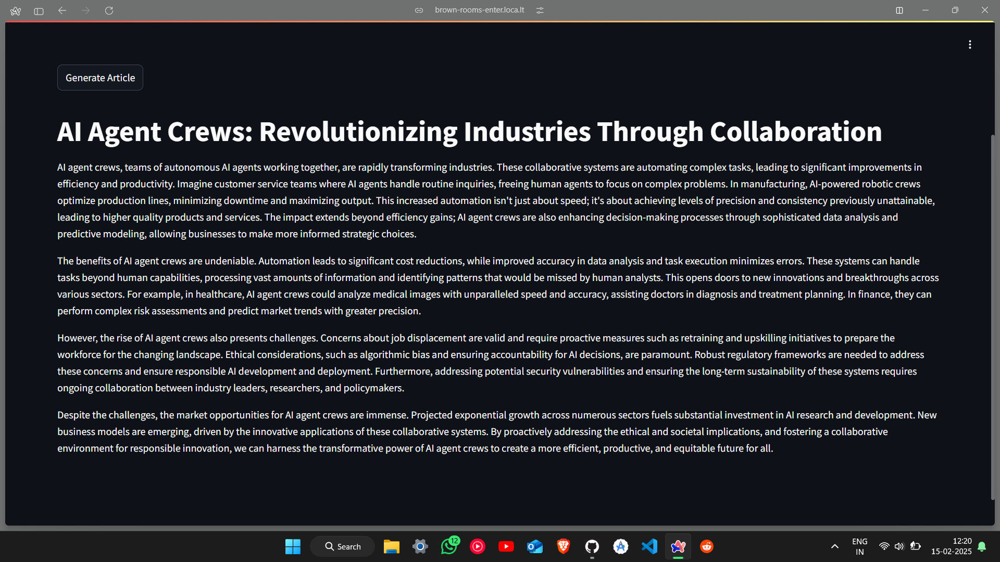

# AI News Agent



## Overview

The AI News Agent is a powerful tool designed to help you discover and write compelling articles on the latest tech trends with AI assistance. This project leverages advanced AI models to research and generate insightful content on various technology topics.

## Features

- **Research Task**: Identifies the next big trend in a given topic, focusing on pros and cons, market opportunities, and potential risks.
- **Writing Task**: Composes an engaging and easy-to-understand article on the latest trends and their impact on the industry.
- **Streamlit App**: Provides a user-friendly interface to input topics and generate articles.

## Installation

1. Clone the repository:
    ```sh
    git clone <repository-url>
    cd "AI News Agent"
    ```

2. Install the required packages:
    ```sh
    pip install -r requirements.txt
    ```

3. Set up environment variables:
    ```sh
    cp .env.example .env
    # Update .env with your API keys
    ```

## Usage

1. Run the Streamlit app:
    ```sh
    streamlit run AI_News_Agent.py
    ```

2. Open your browser and navigate to the provided URL.

3. Enter a technology topic and click "Generate Article" to see the AI-generated content.

## Files

- [AI_News_Agent.py](http://_vscodecontentref_/0): Main script for the Streamlit app.
- `AI News Agent.ipynb`: Jupyter notebook for development and testing.
- `demo.png`: Demo image showcasing the app.
- `requirements.txt`: List of required Python packages.
- `.env`: Environment variables file.

## License

This project is licensed under the MIT License. See the LICENSE file for details.

## Acknowledgements

- [Streamlit](https://streamlit.io/)
- [OpenAI](https://openai.com/)